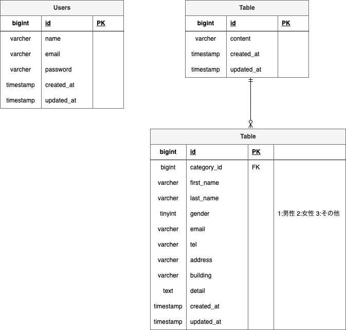

# アプリケーション名
FashionablyLate

## アプリケーション概要
```
ユーザーからの問い合わせフォーム管理用アプリケーション
・ユーザー：問い合わせ内容を入力後、送信することができる
・管理者：会員登録後、ユーザーからの問い合わせ内容を一覧で確認することができる
```

## 環境構築
```
### 1. リポジトリをクローン
git clone https://github.com/Tamori169/Tamori-kadai1.git  
cd FashionablyLate

### 2. Dockerコンテナを作成・起動
docker-compose up -d --build

### 3. PHPコンテナに入る
docker-compose exec php bash

### 4. Composerパッケージをインストール
composer install

### 5. .envファイルを作成
cp .env.example .env

### 6. アプリケーションキーを作成
php artisan key:generate

### 7. データベースマイグレーション
php artisan migrate

### 8. シーディング実行
php artisan db:seed
```

## 使用技術(実行環境)
```
- PHP 8.1.34
- Laravel 8.83.8
- MySQL 8.0.26
- Docker / Docker Compose
- phpMyAdmin
- Git / GitHub
```

## ER図
  
usersテーブルはログイン認証用のテーブルのため、他テーブルとのリレーションなし。

## URL
```
- お問い合わせ画面：http://localhost
- ユーザー登録画面：http://localhost/register
- ログイン画面：http://localhost/login
- 管理者画面：http://localhost/admin (ログイン後アクセス可能)
- phpMyAdmin：http://localhost:8080
```

